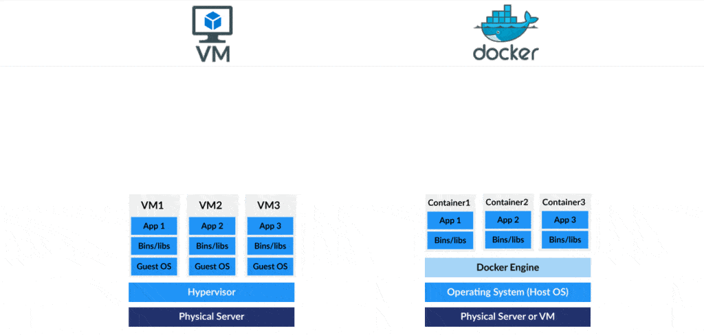
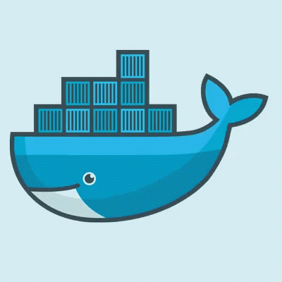

# Docker cheatsheet
### Docker and its interesting world!

Docker is a platform for virtualization that helps developers and software engineers to run their applications in a separate and isolated environment. With Docker, you can define the software infrastructure needed to run your application in a separate and standardized way and package it with your application into a portable and self-sufficient unit called a Container.




This technology provides features such as isolation, fast configuration, and easy mobility between development and production environments. By using Docker, you only need to define a Docker container for your application and its required runtime environment, package it into a portable bundle, and then run it on any Docker-compatible system.

The use of Docker not only reduces installation and configuration time but also allows you to run your applications on platforms that have different characteristics such as different operating systems, versions, and libraries.



<h1>Better accessibility</h1>
To deal with internet problems, you can use the following mirrors in the `nano /etc/docker/daemon.json` config file as below:

```
{
  "registry-mirrors": ["https://docker.iranserver.com"]
}
```
Then, you can run the following commands:
```
systemctl daemon-reload
systemctl restart docker
```

## Here are some important and useful Docker commands:

### Container
* Creating a container from a specific image
```
docker container run my_image
```

* Creating a container from a special image and binding Docker port 8000 to 1000
```
docker run -i -t -p 1000:8000 --rm my_image
```

* Creating a container from a special image and binding Docker port 8000 to 1000 host and bind mounting the `/HostPath` folder of the host to `/insidePath` of the container
```
docker run -v /HostPath:/insidePath -p 1000:8000 my_image
```

* Creating a container from a specific image and executing the my_command command in Docker
```
docker container run -it my_image my_command
```

* Create a container from specific image and detach it (Run in the background)
```
docker run -d -p 1000:8000 --rm --name my_image my_image:latest
```

* Show list of my active containers
```
docker ps
```

* Show list of all my containers
```
docker ps -a
```

* Start a specific container
```
docker start CONTAINER_ID
```

* Stop a specific container
```
docker stop CONTAINER_ID
```

* Remove a specific container
```
docker rm CONTAINER_ID
```

* Display logs of a specific container
```
docker logs CONTAINER_ID
```

* Kill a specific container
```
docker kill CONTAINER_ID
```

<hr>

### Image
* Show list of my docker images
```
docker images ls
```

* Get a simple Hello-world image
```
docker pull hello-world
```

* Run Hello-world docker image
```
docker run hello-world
```

* Build Docker image
```
docker image build . -t my_repo/my_image:my_tag
```

* Build Docker image from DockerFile
```
docker build -t my_repo/my_image:my_tag -f Dockerfile .
```

* Create a backup from docker image
```
docker save --output bk_khalooei.tar my_image:latest
```

* Load a docker image 
```
docker load --input bk_khalooei.tar
```

* More information about Docker Image
```
docker inspect <imagename>
```
<hr>

### Volume
* Show list of my Docker volumes
```
docker volome ls
```

* Display the information of a volume
```
docker volume inspect VOLUME_NAME
```

* Delete all unused volumes
```
docker volume prune
```

### MORE
* Docker version
```
docker version
```

* Enable Docker service on Linux
```
sudo systemctl enable docker
sudo systemctl start docker
```


### References
* https://docs.docker.com/glossary/
* https://docs.docker.com/get-started/
* https://docker-curriculum.com/
* https://www.tutorialspoint.com/docker/index.htm
* https://blog.knoldus.com/docker-basics-and-terminologies/
